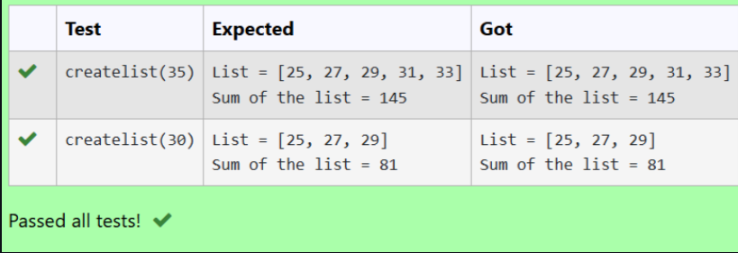

# List Operations in Python: Sum of List Items

## 🎯 Aim
To write a Python program that calculates the **sum of all elements** in a list.

## 🧠 Algorithm
1. Define a list of numbers.
2. Use Python’s built-in `sum()` function to calculate the total.
3. Print the result.

## 🧾 Program
```
def createlist(a):
l = []
  for i in range(a):
  if i%2!=0:
      l.append(i)
print(l)
print(sum(l))
```
## Output



## Result
Thus To write a Python program that calculates the sum of all elements in a list is executed successfully.