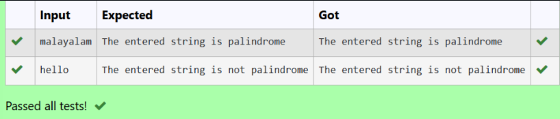

# Strings-Palindrome Check in Python (Without Built-in Functions)

## 🎯 Aim
To write a Python program to check whether the string `"google"` is a **palindrome** or not, without using built-in palindrome checking functions.

## 🧠 Algorithm
1. Assign the string `"google"` to a variable.
2. Reverse the string manually using slicing (`[::-1]`).
3. Compare the original string with the reversed string.
   - If they are equal, print that the string is a palindrome.
   - Otherwise, print that it is not a palindrome.
4. Execute the program.

## 🧾 Program
```
a = "google"
if a==a[::-1]:
   print("Palindrome")
else:
   print("Not a Palindrome")
```
## Output

## Result
Thus a Python program to check whether the string "google" is a palindrome or not, without using built-in palindrome checking functions is executed successfully.